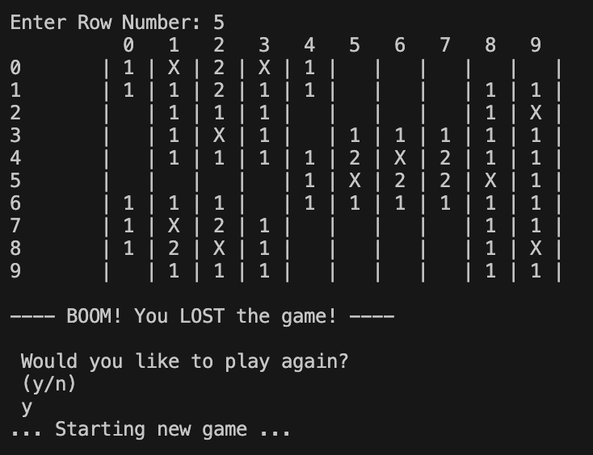

# Minesweeper Game: Java CLI

## Demo & Snippets

The cascade in action:

Playing again after losing the game:

---

## Requirements / Purpose

The MVP for this project was to recreate a simplified version of Minesweeper
to be played in the JAVA console. The user should be able to enter coordinates
and then the console will render the game grid, and display a number from 0-8, based on the proximity of mines.

In this project, I also took on the bonus challenge of using recursion to allow for all surrounding empty squares to be revealed if the user selects an empty square, which ends when a mine is within two squares of an empty one.

I made the game while learning Java for the first time, so the purpose of the project was to demonstrate that I understood the basics of Java and that I would be able to further build on my skills outside of the classroom.

---

## Features

The Java Minesweeper game:

-   Creates and renders a game grid in the Java Console
-   Displays mine proximity based on user input
-   Reveals all surrounding empty squares if the user selects an empty square

---

## Future Goals

I would love to improve the game in the future, by:

-   Using different colours for each of the numbers, and the mines, to make it look more like Minesweeper itself
-   Allowing for the user to input the size of the grid, and how many bombs there are
-   Creating a GUI for the game

---

## Problems faced and how they were resolved

The main issue I had to overcome when designing the game was how to get the cascade working. My first attempt at the cascade - that is, having all empty squares reveal themselves when the user clicks on an empty square - functioned _almost_ how I wanted it to, minus a few bugs, and was hundreds of lines long. It was unwieldy, didn't really do what I wanted, and very, very repetitive. Despite being messy, writing that initial code taught me a lot and made me really think about how I wanted the game to work.

I then thought about how I could refactor that code, and make it more efficient, and started reading articles on recursion. I realised that the problem I had been trying to solve could be solved relatively simply using a recursive method.
The way that method would work would be that if my code knew that the user was selecting an empty square, it would check to see if that square had already been revealed. If it hadn't been revealed already, it would pop all the surrounding empty squares into an array list, and then run the method on each item in the array if they hadn't already been revealed.

Once I implemented recursion, I found that I could solve the problem with under twenty lines of code, compared to the hundreds I had been writing previously, and fix all the bugs my previous code had introduced to the game.
